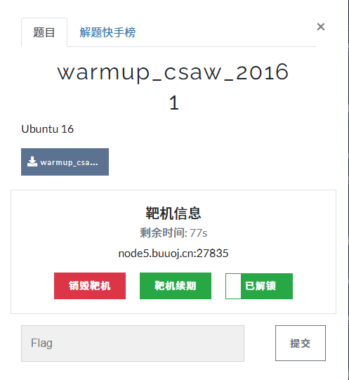

---

### 1. 靶机环境
* **平台**：BUUCTF
* **环境**：Ubuntu 16 (64位)
* **远程地址**：`node5.buuoj.cn:27835`

---

### 2. 静态分析 (IDA Pro)

* **main 函数漏洞点**：程序使用了危险的 **`gets(v5)`** 函数，该函数**未限制用户输入范围**，存在典型的栈溢出漏洞。同时，程序显式打印了提示地址：**`0x40060D`**。

![[2.png|1.png]]

* **后门函数 (sub_40060D)**：跟进该地址，发现其直接调用了 `system("cat flag.txt")`。此地址即为我们的**目标跳转执行流**。

---

### 3. 核心步骤：栈溢出布局计算

查看 IDA 栈视图，分析变量到返回地址的距离：
* `v5` 缓冲区 (`var_40`)：**64 字节**
* 保存的 `RBP` 寄存器：**8 字节**

> 💡 **溢出攻击逻辑**：
> 先输入 72 字节的垃圾数据填满缓冲区与 RBP，随后紧跟 8 字节的后门地址，即可在函数返回时劫持 `RIP` 指针。

$$\text{填充长度 (Padding)} = 64 \text{ 字节 (缓冲区)} + 8 \text{ 字节 (Saved RBP)} = 72 \text{ 字节}$$

![[3.png]]

---

### 4. Exploit 脚本 (Pwntools)

编写 Python 攻击脚本，构造核心 Payload：**`b'a' * 72 + p64(0x40060D)`**。

![[4.png]]

---

### 5. 攻击执行结果

运行脚本，成功触发后门并回显 Flag：
**`flag{B14e50df-76d0-42c9-9128-fa4bf278e2a4}`**

![[5.png]]